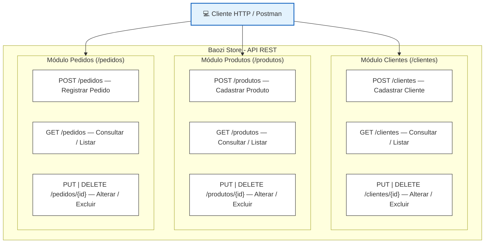

# 🥟 Baozi Store - API REST

**Disciplina:** Desenvolvimento Web Back-End  
**Instituição:** UNINTER  
**Aluno:** Allan Almeida4976216  
**Tecnologias:** Java, Spring Boot, Spring Data JPA, H2 Database, Maven, Postman  

---

## 1. Descrição do Projeto

A **Baozi Store** é uma API REST desenvolvida em Java com Spring Boot e Spring Data JPA, utilizando o banco de dados relacional em memória **H2 Database** para gerenciamento de clientes, produtos e pedidos de uma loja especializada na venda de pãezinhos chineses (*baozi*).

### Cenário de Negócio
- A loja realiza a gestão centralizada de seus **clientes**, **produtos** (ex: *Baozi Tradicional*) e **pedidos**.
- Cada pedido registra a vinculação com o cliente comprador, o produto adquirido e a quantidade solicitada, realizando validações automáticas de existência no banco de dados.

---

## 2. Tecnologias Utilizadas

* **Linguagem:** Java (versão 17+)
* **Framework:** Spring Boot (versão 3.3.4)
* **Persistência de Dados:** Spring Data JPA / Hibernate
* **Banco de Dados:** H2 Database (banco relacional em memória)
* **Gerenciador de Dependências:** Apache Maven (com Maven Wrapper `mvnw` incluso)
* **Arquitetura:** MVC (Model, Repository, Controller)
* **Formato de Troca de Dados:** JSON

---

## 3. Estrutura do Projeto

```
baozi-store/
├── src/
│   ├── main/
│   │   ├── java/com/baozistore/
│   │   │   ├── config/
│   │   │   │   └── DataInitializer.java        # Carga dos dados iniciais
│   │   │   ├── controller/
│   │   │   │   ├── ClienteController.java      # Endpoints REST de Clientes
│   │   │   │   ├── PedidoController.java       # Endpoints REST de Pedidos
│   │   │   │   └── ProdutoController.java      # Endpoints REST de Produtos
│   │   │   ├── exception/
│   │   │   │   ├── ErrorResponse.java          # Formato padrao de erros JSON
│   │   │   │   ├── GlobalExceptionHandler.java # Tratamento global de excecoes (404, 400)
│   │   │   │   └── ResourceNotFoundException.java
│   │   │   ├── model/
│   │   │   │   ├── Cliente.java                # Entidade JPA Cliente
│   │   │   │   ├── Pedido.java                 # Entidade JPA Pedido
│   │   │   │   └── Produto.java                # Entidade JPA Produto
│   │   │   ├── repository/
│   │   │   │   ├── ClienteRepository.java      # Spring Data JPA Repository
│   │   │   │   ├── PedidoRepository.java       # Spring Data JPA Repository
│   │   │   │   └── ProdutoRepository.java      # Spring Data JPA Repository
│   │   │   └── BaoziStoreApplication.java      # Classe principal
│   │   └── resources/
│   │       └── application.properties          # Configuracoes do Spring Boot e H2
│   └── test/
│       └── java/com/baozistore/
│           └── BaoziStoreApplicationTests.java # Testes de integracao automatizados
├── mvnw                                        # Script Maven Wrapper (Linux/macOS)
├── mvnw.cmd                                    # Script Maven Wrapper (Windows)
├── pom.xml                                     # Configuracao Maven
└── README.md                                   # Documentacao do projeto
```

---

## 4. Como Executar o Projeto

### Pré-requisitos
* Java JDK (versão 17 ou superior) instalado e configurado no PATH.

### Execução

1. No terminal, navegue até o diretório `baozi-store`:
   * **Windows (PowerShell / Command Prompt):**
     ```powershell
     .\mvnw spring-boot:run
     ```
   * **Linux / macOS:**
     ```bash
     ./mvnw spring-boot:run
     ```

2. **URL Base da API:**
   `http://localhost:8080`

---

## 5. Acesso ao Console do Banco de Dados H2

Para visualizar as tabelas do banco de dados relacional em tempo real:

* **URL do Console Web:** `http://localhost:8080/h2-console`
* **JDBC URL:** `jdbc:h2:mem:baozidb`
* **User Name:** `sa`
* **Password:** *(deixe em branco)*

---

## 6. Especificação Completa dos Endpoints REST

### 6.1. Endpoints de Clientes (`/clientes`)

| Método | Endpoint | Descrição | Resposta de Sucesso |
| :--- | :--- | :--- | :--- |
| `POST` | `/clientes` | Cadastrar novo cliente | `201 Created` |
| `GET` | `/clientes` | Listar todos os clientes | `200 OK` |
| `GET` | `/clientes/{id}` | Consultar cliente por ID | `200 OK` (ou `404 Not Found`) |
| `PUT` | `/clientes/{id}` | Atualizar cliente por ID | `200 OK` (ou `404 Not Found`) |
| `DELETE` | `/clientes/{id}` | Excluir cliente por ID | `204 No Content` (ou `404 Not Found`) |

### 6.2. Endpoints de Produtos (`/produtos`)

| Método | Endpoint | Descrição | Resposta de Sucesso |
| :--- | :--- | :--- | :--- |
| `POST` | `/produtos` | Cadastrar novo produto | `201 Created` |
| `GET` | `/produtos` | Listar todos os produtos | `200 OK` |
| `GET` | `/produtos/{id}` | Consultar produto por ID | `200 OK` (ou `404 Not Found`) |
| `PUT` | `/produtos/{id}` | Atualizar produto por ID | `200 OK` (ou `404 Not Found`) |
| `DELETE` | `/produtos/{id}` | Excluir produto por ID | `204 No Content` (ou `404 Not Found`) |

### 6.3. Endpoints de Pedidos (`/pedidos`)

| Método | Endpoint | Descrição | Resposta de Sucesso |
| :--- | :--- | :--- | :--- |
| `POST` | `/pedidos` | Registrar novo pedido | `201 Created` |
| `GET` | `/pedidos` | Listar todos os pedidos | `200 OK` |
| `GET` | `/pedidos/{id}` | Consultar pedido por ID | `200 OK` (ou `404 Not Found`) |
| `PUT` | `/pedidos/{id}` | Atualizar pedido por ID | `200 OK` (ou `404 Not Found`) |
| `DELETE` | `/pedidos/{id}` | Excluir pedido por ID | `204 No Content` (ou `404 Not Found`) |

---

## 7. Roteiro de Testes no Postman

Execute as requisições utilizando a coleção [`baozi_store_postman_collection.json`](./baozi_store_postman_collection.json):

### Exemplo 1: Cadastrar Cliente (`POST /clientes`)
* **URL:** `http://localhost:8080/clientes`
* **Body:**
```json
{
  "nome": "Allan Almeida4976216",
  "clienteDesde": "2026-10-06"
}
```

### Exemplo 2: Cadastrar Produto (`POST /produtos`)
* **URL:** `http://localhost:8080/produtos`
* **Body:**
```json
{
  "nome": "Baozi Tradicional",
  "preco": 8.50,
  "estoque": true
}
```

### Exemplo 3: Registrar Pedido (`POST /pedidos`)
* **URL:** `http://localhost:8080/pedidos`
* **Body:**
```json
{
  "clienteId": 1,
  "produtoId": 1,
  "quantidade": 5
}
```

---

## 8. Diagrama de Casos de Uso UML



---

## 9. Validações e Regras de Negócio

1. **Cliente:** Nome é obrigatório (`@NotBlank`); Data `clienteDesde` é obrigatória (`@NotNull`).
2. **Produto:** Nome é obrigatório (`@NotBlank`); Preço deve ser maior ou igual a zero (`@DecimalMin("0.0")`); Campo `estoque` é obrigatório (`@NotNull`).
3. **Pedido:** `clienteId` e `produtoId` são obrigatórios; `quantidade` deve ser maior que zero (`@Min(1)`).
4. **Relacionamento Pedido -> Cliente / Produto:** Validação automática da existência das entidades no banco. Retorna `404 Not Found` caso o `clienteId` ou `produtoId` não exista.
